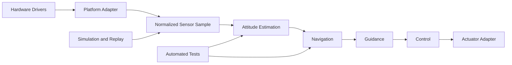

# Guidance, Navigation, and Control

A portable Guidance, Navigation, and Control engineering workspace for
developing, testing, and documenting algorithms used in rockets, spacecraft,
desktop simulation, and future custom flight computers.

The initial foundation is based on publicly shareable work performed with
Sun Devil Rocketry, including:

- quaternion mathematics;
- body-to-world and world-to-body frame rotations;
- gravity compensation;
- world-frame velocity integration;
- a Mahony attitude filter;
- the beginning of a six-state Multiplicative Extended Kalman Filter.

Sun Devil Rocketry Flight Computer Rev 2 is the first reference platform, but
the portable GNC implementation is intentionally separated from STM32 HAL,
board-specific drivers, telemetry, and application logic.

## Current Status

```text
Quaternion and frame mathematics     ██████████  Complete
Gravity compensation                 ██████████  Complete
Mahony attitude filter               ██████████  Software complete
Mahony hardware validation           ██░░░░░░░░  In progress
MEKF initialization                  ██████░░░░  Started
MEKF prediction                      ██░░░░░░░░  Next milestone
Navigation fusion                    █░░░░░░░░░  Early foundation
Guidance                             ░░░░░░░░░░  Planned
Control                              ░░░░░░░░░░  Planned
```

## Architecture



## Documentation

The complete architecture, roadmap, conventions, current implementation state,
and validation strategy are maintained in:

[`docs/GNC_MASTER_PLAN.md`](docs/GNC_MASTER_PLAN.md)

## Engineering Conventions

- Quaternion ordering: `[w, x, y, z]`
- Attitude quaternion: body-to-world
- Gyroscope input: rad/s
- Acceleration: m/s²
- Timestamp: integer microseconds
- Internal calculations: SI units

## Repository Status

This repository is currently under initial construction. The first development
milestones are:

1. Establish the portable host build.
2. Port vector and quaternion mathematics.
3. Port and preserve Mahony filter behavior.
4. Add MEKF initialization and prediction tests.
5. Implement MEKF quaternion and covariance prediction.
