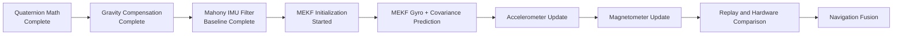
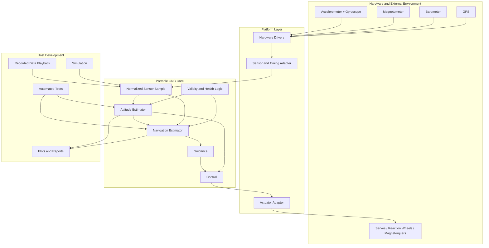
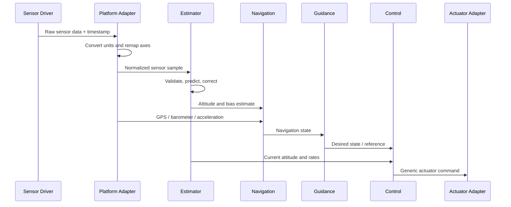
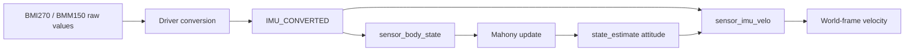
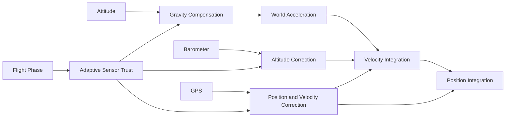
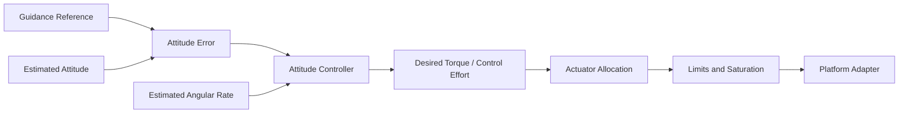
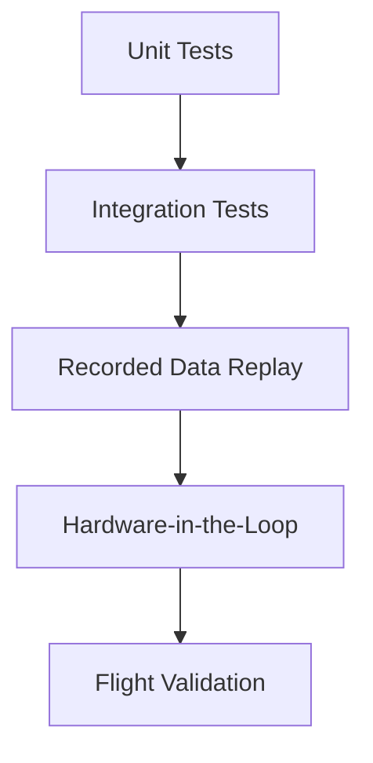
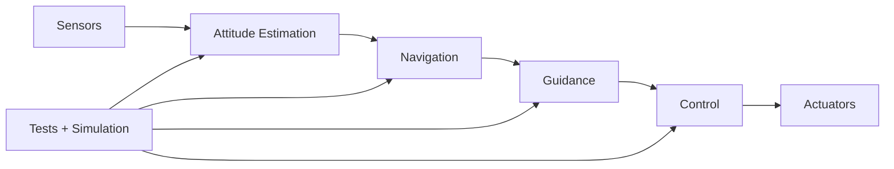

# Guidance, Navigation, and Control Workspace Master Plan

**Document version:** 2.1  
**Status:** Living engineering blueprint  
**Last updated:** July 27, 2026  
**Primary repository:** `guidance-navigation-control`  
**Current upstream implementation:** Sun Devil Rocketry Flight Computer Firmware / `mod`  
**Primary development language:** C11  
**Target environments:** Desktop host, STM32H7, future custom flight computers, and future CubeSat avionics

> **Purpose:** This document is the single authoritative plan for creating and developing a portable Guidance, Navigation, and Control workspace. It records the current implementation state, architecture, conventions, verification evidence, roadmap, and development procedures. It is deliberately structured so routine updates remain easier than the GNC work itself.

---

## How to Use This Document

This file has four jobs:

1. **Describe the system that exists today.**
2. **Define the architecture future work must follow.**
3. **Show the next useful engineering milestone.**
4. **Preserve why important decisions were made.**

It is not intended to become a daily diary or a duplicate of every source-code comment. Detailed theory, test results, experiment reports, and decision records may eventually live in separate files, but this master plan remains the index and source of truth.

### Low-Maintenance Rule

After an ordinary development session, update only these sections:

1. [Status Dashboard](#status-dashboard)
2. [Immediate Next Actions](#immediate-next-actions)
3. [Verification Evidence](#verification-evidence)
4. [Change Log](#change-log)

Only update the deeper architecture sections when a design decision actually changes.

### Stable Update Markers

The following comments are intentionally included so ChatGPT or a simple script can locate frequently updated sections without rewriting the entire document:

```text
<!-- GNC_STATUS_BEGIN -->
<!-- GNC_STATUS_END -->

<!-- GNC_NEXT_ACTIONS_BEGIN -->
<!-- GNC_NEXT_ACTIONS_END -->

<!-- GNC_EVIDENCE_BEGIN -->
<!-- GNC_EVIDENCE_END -->

<!-- GNC_CHANGELOG_BEGIN -->
<!-- GNC_CHANGELOG_END -->
```

When this file is sent back for an update, include the new source files, commit diff, test output, or a concise description of completed work. The document should then be revised in place rather than replaced with a differently structured plan.

---

# Table of Contents

1. [Executive Summary](#executive-summary)
2. [Status Dashboard](#status-dashboard)
3. [Immediate Next Actions](#immediate-next-actions)
4. [Mission, Scope, and Non-Goals](#mission-scope-and-non-goals)
5. [System Architecture](#system-architecture)
6. [Repository Architecture](#repository-architecture)
7. [Canonical Engineering Conventions](#canonical-engineering-conventions)
8. [Portable Data Contracts and APIs](#portable-data-contracts-and-apis)
9. [Current SDR Rev 2 Baseline](#current-sdr-rev-2-baseline)
10. [Quaternion and Frame Mathematics](#quaternion-and-frame-mathematics)
11. [Gravity Compensation and Inertial Integration](#gravity-compensation-and-inertial-integration)
12. [Mahony Attitude Filter](#mahony-attitude-filter)
13. [MEKF Design Specification](#mekf-design-specification)
14. [Navigation Architecture](#navigation-architecture)
15. [Guidance Architecture](#guidance-architecture)
16. [Control Architecture](#control-architecture)
17. [Platform Adapter Architecture](#platform-adapter-architecture)
18. [Simulation and Data Playback](#simulation-and-data-playback)
19. [Testing and Validation Strategy](#testing-and-validation-strategy)
20. [Hardware and Mechanical Validation](#hardware-and-mechanical-validation)
21. [Telemetry, Logging, and Data Management](#telemetry-logging-and-data-management)
22. [Reliability and Failure Handling](#reliability-and-failure-handling)
23. [Coding and Build Standards](#coding-and-build-standards)
24. [Git and GitHub Workflow](#git-and-github-workflow)
25. [SDR Extraction and Workspace Creation Plan](#sdr-extraction-and-workspace-creation-plan)
26. [ChatGPT and Git Bash Development Workflow](#chatgpt-and-git-bash-development-workflow)
27. [Roadmap and Milestones](#roadmap-and-milestones)
28. [Algorithm Maturity Model](#algorithm-maturity-model)
29. [Documentation and Decision Records](#documentation-and-decision-records)
30. [Research Program](#research-program)
31. [Verification Evidence](#verification-evidence)
32. [Open Decisions and Risks](#open-decisions-and-risks)
33. [GitHub Launch Checklist](#github-launch-checklist)
34. [Change Log](#change-log)
35. [Appendices](#appendices)

---

# Executive Summary

The `guidance-navigation-control` repository will be a portable engineering platform for developing, testing, and validating GNC algorithms independently of any single flight computer.

Sun Devil Rocketry Flight Computer Rev 2 is the first reference platform, but it must not define the portable architecture. The repository should support:

- Rocket attitude estimation
- Inertial navigation
- Flight-phase estimation
- Future active guidance and control
- Desktop simulation and sensor replay
- Future custom flight-computer hardware
- Future satellite attitude determination and control work

The current technical foundation is stronger than a blank repository:

- Quaternion operations and documented frame rotations are implemented.
- Gravity compensation and world-frame velocity integration are implemented.
- A Mahony IMU attitude filter is implemented, unit tested, and integrated into `sensor_body_state()`.
- The Mahony implementation currently writes its body-to-world quaternion into `state_estimate->attitude`.
- The Mahony test suite last recorded **20,141 passes and 0 failures**.
- A separate MEKF branch has begun.
- The MEKF checkpoint currently includes the shared vector-type prerequisite, `mekf.h`, and initialization work.
- MEKF prediction and tests are the next implementation milestone.
- Mahony remains the active reference estimator while the MEKF matures.

The central architectural rule is:

```text
Hardware drivers
      ↓
Platform adapter
      ↓
Normalized sensor sample
      ↓
Portable estimator / navigation / guidance / control
      ↓
Generic output
      ↓
Platform-specific actuator adapter
```

---

# Status Dashboard

<!-- GNC_STATUS_BEGIN -->

## Overall Program Status

```text
Portable architecture definition     ████████░░  80%
Quaternion and frame mathematics     ██████████ 100%
Gravity compensation                 ██████████ 100%
Mahony implementation                ██████████ 100%
Mahony host unit tests               ██████████ 100%
Mahony SDR integration               ██████████ 100%
Mahony hardware validation           ██░░░░░░░░  20%
MEKF interface and initialization    ██████░░░░  60%
MEKF quaternion prediction           ██░░░░░░░░  20%
MEKF covariance prediction           ██░░░░░░░░  20%
MEKF accelerometer update            ░░░░░░░░░░   0%
MEKF magnetometer update             ░░░░░░░░░░   0%
Recorded-data playback               ░░░░░░░░░░   0%
Navigation fusion                    █░░░░░░░░░  10%
Guidance                             ░░░░░░░░░░   0%
Control                              ░░░░░░░░░░   0%
HIL validation                       ░░░░░░░░░░   0%
Flight validation                    ░░░░░░░░░░   0%
```

> Percentages are engineering maturity indicators, not schedule estimates.

## Current Baseline Summary

| Area | State | Current implementation | Next proof required |
|---|---|---|---|
| Quaternion math | Complete | `math_sdr` body/world transforms and quaternion utilities | Preserve behavior in portable module |
| Gravity compensation | Complete in SDR branch | Rotate world gravity to body, subtract, rotate linear acceleration to world, integrate velocity | Replay and hardware validation |
| Mahony | Complete for current IMU scope | Gyro propagation, proportional accel correction, integral correction, anti-windup, validity gating | Hardware logging and tuning |
| Mahony integration | Complete in source | `sensor_body_state()` → `mahony_update_imu()` → `state_estimate->attitude` | Confirm timing and behavior on Rev 2 |
| MEKF | Started | 6-state design, header and initialization checkpoint | Implement and test `mekf_predict()` |
| Magnetometer fusion | Deferred | BMM150 conversion path exists, calibration not flight-qualified | Axis mapping, calibration, interference testing |
| Navigation | Early foundation | Gravity-compensated velocity integration | Timestamp validation, replay, GPS/barometer fusion |
| Guidance | Planned | Interfaces only | Define first mission use case |
| Control | Planned | Existing SDR servo concepts are reference only | Define generic command and allocation interfaces |

## Estimator Progression



## Current Branch Checkpoints

| Work | Branch / checkpoint | Recorded state |
|---|---|---|
| Gravity compensation | `feature/gravity-compensated-acceleration` | Quaternion rotations, gravity compensation, world-frame velocity work completed; PR #138 was awaiting review |
| Mahony | `feature/mahony-attitude-filter` | Implemented and integrated; PR intentionally delayed pending hardware testing |
| Mahony sensor integration | Commit `eaa16ed` | `sensor/sensor.c` changed to use the Mahony filter as the live attitude estimator |
| MEKF | `feature/mekf-attitude-filter` | Checkpoint recorded at commit `acab7f4`; shared vector type prerequisite committed, header and initialization started; prediction/tests not yet complete |

<!-- GNC_STATUS_END -->

---

# Immediate Next Actions

<!-- GNC_NEXT_ACTIONS_BEGIN -->

## Active Milestone: MEKF Prediction Foundation

The next engineering task should remain narrow:

1. Inspect the current `mekf/mekf.h` and `mekf/mekf.c`.
2. Preserve the Milestone 1 API scope:
   - nominal body-to-world quaternion
   - three-axis gyro bias
   - `6 × 6` covariance
   - `MEKF_CONFIG`
   - `mekf_init()`
   - `mekf_predict()`
3. Implement bias-corrected gyro propagation.
4. Normalize the nominal quaternion after propagation.
5. Implement the `6 × 6` state-transition and covariance prediction.
6. Add the first MEKF test target.
7. Validate initialization before testing dynamic propagation.
8. Add constant-rate propagation tests.
9. Add zero-rate and zero-bias tests.
10. Add covariance symmetry, finite-value, and diagonal nonnegativity checks.

Do **not** add accelerometer APIs, magnetometer APIs, GPS, barometer, velocity, or position during this milestone.

## Parallel Low-Risk Task

Create the initial portable workspace and import the already completed math and Mahony code as reference material without changing their behavior.

## Hardware Validation Task

Before opening the Mahony PR:

- Confirm attitude updates on Rev 2 hardware.
- Record actual update interval statistics.
- Log quaternion norm.
- Log accelerometer correction enabled/disabled state.
- Check stationary convergence.
- Check controlled rotations.
- Confirm no NaN or discontinuity after startup.
- Compare gyro-only and acceleration-corrected behavior under known motions.

<!-- GNC_NEXT_ACTIONS_END -->

---

# Mission, Scope, and Non-Goals

## Mission

Develop a portable, testable, well-documented GNC platform that supports reusable algorithms across rockets, spacecraft, desktop simulations, and future custom embedded hardware.

## Primary Objectives

1. Preserve the value of completed SDR work.
2. Decouple algorithms from STM32 and Rev 2 details.
3. Make estimator comparison straightforward.
4. Provide deterministic host-side testing.
5. Build a clear path from attitude estimation to navigation, guidance, and control.
6. Maintain professional engineering evidence.
7. Keep documentation cheap to update.

## In Scope

- Vectors, matrices, quaternions, and numerical helpers
- Coordinate-frame transformations
- Sensor normalization
- Attitude estimation
- Gyro-bias estimation
- Gravity compensation
- Inertial velocity and position estimation
- Barometer and GPS fusion
- Flight-phase estimation
- Guidance-reference generation
- Control laws and actuator allocation
- Host simulation
- Recorded sensor replay
- Automated testing
- HIL interfaces
- Mechanical validation fixtures
- Platform adapters
- Engineering documentation and decision records

## Non-Goals

The portable core is not responsible for:

- STM32 clock initialization
- Peripheral configuration
- USB terminal commands
- LoRa communication
- Flash logging implementation
- LED or buzzer behavior
- Ignition sequencing
- Board-specific pin definitions
- Full SDR application-state behavior
- Mission-sensitive or private flight data
- Replacing organization repositories

These services may connect through platform adapters but must not become dependencies of the portable algorithms.

---

# System Architecture

## Functional Architecture



## Dependency Rule

Dependencies point inward toward stable portable interfaces.

```text
Application / hardware code
           ↓
Platform adapters
           ↓
Portable public interfaces
           ↓
Portable implementation
           ↓
Math primitives
```

Portable math cannot include platform code. Estimators cannot call USB, flash, or HAL. Guidance cannot directly command a Rev 2 servo. Control produces generic commands; adapters map them to physical actuators.

## Update Loop Concept



## Estimator Selection

Mahony and MEKF should share an estimator abstraction.

```c
typedef enum
{
    GNC_ESTIMATOR_MAHONY = 0,
    GNC_ESTIMATOR_MEKF
} gnc_estimator_type_t;
```

The system should not rely on preprocessor replacement of one estimator by another unless required by embedded constraints. Prefer a small explicit interface with compile-time selection available as an optimization.

---

# Repository Architecture

## Recommended Workspace

```text
GNC-Workspace/
├── Flight-Computer-Firmware/          # Upstream SDR working copy
└── guidance-navigation-control/       # Portable personal repository
```

## Recommended Repository Tree

```text
guidance-navigation-control/
├── README.md
├── LICENSE
├── NOTICE
├── CHANGELOG.md
├── CMakeLists.txt
├── cmake/
│   └── warnings.cmake
├── include/
│   └── gnc/
│       ├── gnc.h
│       ├── types.h
│       ├── config.h
│       ├── status.h
│       ├── estimator.h
│       ├── navigation.h
│       ├── guidance.h
│       └── control.h
├── src/
│   ├── math/
│   │   ├── vector3.c
│   │   ├── matrix.c
│   │   ├── quaternion.c
│   │   └── numeric.c
│   ├── attitude/
│   │   ├── attitude_common.c
│   │   ├── mahony.c
│   │   └── mekf.c
│   ├── navigation/
│   │   ├── gravity.c
│   │   ├── inertial.c
│   │   ├── barometer.c
│   │   ├── gps.c
│   │   └── flight_phase.c
│   ├── guidance/
│   └── control/
├── platforms/
│   ├── host/
│   │   ├── host_clock.c
│   │   └── csv_playback.c
│   ├── sdr-rev2/
│   │   ├── README.md
│   │   ├── sdr_sensor_adapter.c
│   │   ├── sdr_timing_adapter.c
│   │   └── sdr_actuator_adapter.c
│   ├── custom-stm32/
│   └── cubesat/
├── tests/
│   ├── framework/
│   ├── unit/
│   │   ├── test_vector3.c
│   │   ├── test_quaternion.c
│   │   ├── test_gravity.c
│   │   ├── test_mahony.c
│   │   └── test_mekf.c
│   ├── integration/
│   ├── regression/
│   ├── performance/
│   └── data/
│       ├── synthetic/
│       └── public/
├── simulation/
│   ├── python/
│   ├── rocket/
│   ├── satellite/
│   ├── sensors/
│   └── monte_carlo/
├── tools/
│   ├── import_sdr_rev2.sh
│   ├── run_checks.sh
│   ├── generate_status.py
│   └── plot_results.py
├── upstream/
│   └── sdr-rev2/
│       ├── README.md
│       ├── SOURCE_REVISIONS.txt
│       └── reference/
├── docs/
│   ├── GNC_MASTER_PLAN.md
│   ├── architecture/
│   ├── algorithms/
│   ├── testing/
│   ├── decisions/
│   ├── experiments/
│   └── references/
└── research/
    ├── papers/
    ├── notes/
    └── bibliography.md
```

## Single-File versus Split Documentation

Version 2.0 remains one complete master file for easy handoff and updating.

Split a section into a dedicated document only when one of these becomes true:

- The section exceeds roughly one focused technical chapter.
- It contains generated test plots or extensive result tables.
- It changes independently from the master plan.
- It is useful as standalone contributor documentation.

When split, keep a concise status summary and link in this document. Do not duplicate the entire content.

---

# Canonical Engineering Conventions

These conventions are binding until changed through a design decision record.

## Quaternion Convention

- Ordering: `[w, x, y, z]`
- Meaning: body-to-world attitude
- Symbol: \(q_{bw}\)
- Unit norm required
- Quaternion sign equivalence must be respected: \(q\) and \(-q\) represent the same rotation

## Quaternion Kinematics

The gyroscope measures angular velocity expressed in the body frame:

\[
\boldsymbol{\omega}_b =
\begin{bmatrix}
\omega_x & \omega_y & \omega_z
\end{bmatrix}^T
\]

Represent it as a pure quaternion:

\[
\omega_q = [0,\omega_x,\omega_y,\omega_z]
\]

For the stored body-to-world quaternion:

\[
\dot{q}_{bw}
=
\frac{1}{2}
q_{bw}
\otimes
\omega_q
\]

First-order propagation:

\[
q_{k+1}
=
\operatorname{normalize}
\left(
q_k + \dot{q}_k\Delta t
\right)
\]

Higher-order or exponential-map propagation may be introduced later if justified by accuracy testing.

## Vector Rotations

Body to world:

\[
v_w = q_{bw}\otimes v_b\otimes q_{bw}^{*}
\]

World to body:

\[
v_b = q_{bw}^{*}\otimes v_w\otimes q_{bw}
\]

## World Frame

The current SDR gravity-compensation implementation defines world gravity in the positive world Z direction:

```c
gravity_world = { 0.0f, 0.0f, 0.0f, GRAVITY };
```

The portable repository must explicitly name the selected world frame. Until a different frame is adopted, use a local launch frame compatible with the existing positive-Z gravity convention and document its axis definitions in `docs/architecture/coordinate-frames.md`.

Do not label the frame ENU or NED unless every axis and gravity sign matches that definition.

## Body Frame

The body frame must be documented per platform.

For rockets, the adapter should remap sensor axes so the agreed body X axis points toward the nose. The remaining Y and Z directions and right-hand convention must be recorded with a physical board/rocket diagram.

## Units

| Quantity | Unit |
|---|---|
| Angular rate | rad/s inside GNC algorithms |
| Public legacy SDR roll rate | deg/s where existing API requires it |
| Acceleration | m/s² |
| Magnetic field | µT |
| Pressure | Pa |
| Altitude | m |
| Velocity | m/s |
| Position | m |
| Time delta | s |
| Timestamp | integer µs |
| Angles in algorithms | rad |
| Angles for human display | deg |

## Time

- Platform adapters provide monotonic integer timestamps.
- Portable code accepts explicit `delta_time_s` or timestamps with defined conversion.
- Reject non-finite, zero, negative, or excessive time deltas.
- First-sample behavior must be explicit.
- Algorithms must never silently depend on wall-clock time.

## Numerical Behavior

- Normalize quaternions after propagation and correction.
- Protect vector normalization against zero magnitude.
- Reject non-finite inputs.
- Avoid hidden unit conversion.
- Avoid integer division during time conversion.
- Keep matrices symmetric when theoretically symmetric.
- Add tolerances appropriate to single-precision embedded use.

---

# Portable Data Contracts and APIs

## Core Types

```c
typedef struct
{
    float x;
    float y;
    float z;
} gnc_vector3f_t;

typedef struct
{
    float w;
    float x;
    float y;
    float z;
} gnc_quaternion_t;

typedef struct
{
    uint64_t timestamp_us;

    gnc_vector3f_t acceleration_body_mps2;
    gnc_vector3f_t angular_rate_body_rad_s;
    gnc_vector3f_t magnetic_field_body_ut;

    float pressure_pa;
    float barometric_altitude_m;

    double latitude_deg;
    double longitude_deg;
    float gps_altitude_m;
    gnc_vector3f_t gps_velocity_world_mps;

    bool imu_valid;
    bool accelerometer_valid;
    bool gyroscope_valid;
    bool magnetometer_valid;
    bool barometer_valid;
    bool gps_valid;
} gnc_sensor_sample_t;
```

## Attitude Estimate

```c
typedef struct
{
    gnc_quaternion_t attitude_body_to_world;
    gnc_vector3f_t angular_rate_body_rad_s;
    gnc_vector3f_t gyro_bias_rad_s;

    float covariance_attitude_bias[6][6];

    bool attitude_valid;
    bool bias_valid;
} gnc_attitude_state_t;
```

The covariance field may be estimator-specific. If Mahony does not provide covariance, its output should clearly mark covariance as unavailable rather than inventing values.

## Navigation State

```c
typedef struct
{
    gnc_vector3f_t linear_acceleration_body_mps2;
    gnc_vector3f_t linear_acceleration_world_mps2;
    gnc_vector3f_t velocity_world_mps;
    gnc_vector3f_t position_world_m;

    float altitude_m;
    float vertical_velocity_mps;

    bool acceleration_valid;
    bool velocity_valid;
    bool position_valid;
    bool altitude_valid;
} gnc_navigation_state_t;
```

## Generic Actuator Command

```c
typedef struct
{
    float channel[4];
    bool enabled;
} gnc_actuator_command_t;
```

A later actuator-allocation interface should define the meaning, range, saturation, and units of every channel.

## Top-Level API Direction

```c
bool gnc_init
    (
    gnc_context_t *context,
    const gnc_config_t *config
    );

bool gnc_reset
    (
    gnc_context_t *context,
    const gnc_initial_state_t *initial_state
    );

bool gnc_update
    (
    gnc_context_t *context,
    const gnc_sensor_sample_t *sample
    );

const gnc_state_t *gnc_get_state
    (
    const gnc_context_t *context
    );
```

The first repository milestone does not need to implement the entire top-level API. It should first port working modules with narrow, tested APIs.

---

# Current SDR Rev 2 Baseline

## Relevant Existing Areas

Likely source areas:

```text
Flight-Computer-Firmware/
├── app/rev2/
├── mod/math_sdr/
├── mod/sensor/
├── mod/mahony/
├── mod/mekf/
├── driver/imu/
├── driver/baro/
├── driver/gps/
└── test/
```

Exact paths must be verified against the checked-out revisions before import.

## Current Sensor Path



## Current Attitude Integration

The latest recorded `sensor_body_state()` behavior:

1. Read a microsecond timestamp.
2. Calculate `delta_time_s`.
3. Fall back to `0.01f` for first sample, invalid, or excessive time delta.
4. Convert gyroscope data from deg/s to rad/s.
5. Pass converted acceleration in m/s².
6. Enable accelerometer correction only when:

```c
get_fc_state() <= FC_STATE_LAUNCH_DETECT
```

7. Call:

```c
mahony_update_imu
    (
    &mahony_filter,
    gyro_body_rad_s,
    accel_body_m_s2,
    delta_time_s,
    use_accel
    );
```

8. Store:

```c
state_estimate->attitude = mahony_filter.attitude;
```

9. Preserve the existing public roll-rate value in deg/s.

## Current Gravity-Compensation Path

1. Define gravity in the world frame.
2. Rotate gravity from world to body with the body-to-world attitude quaternion.
3. Subtract body-frame gravity from the accelerometer measurement.
4. Rotate linear acceleration back to world.
5. Integrate each world-frame acceleration component into velocity.
6. Calculate scalar speed.
7. Save previous velocity and timestamp.

## Upstream versus Portable Code

| Code category | Treatment |
|---|---|
| Quaternion and vector math | Port into clean reusable math module |
| Mahony algorithm | Port behavior and tests; preserve attribution if derived |
| MEKF work | Continue as portable design, then adapt into SDR |
| `sensor_body_state()` | Use as integration reference; do not make it the portable estimator |
| `sensor_imu_velo()` | Extract equations into navigation module |
| IMU/BMM150 drivers | Keep in platform/reference layer |
| Calibration routines | Separate algorithmic calibration from hardware storage |
| Flight-state logic | Keep outside estimator core; pass validity/weighting decisions in |
| Servo logic | Reference for future adapter, not portable control core |
| USB/flash/LoRa/LED/buzzer | Exclude from portable GNC |

---

# Quaternion and Frame Mathematics

## Current Scope

Completed functionality includes:

- Quaternion multiplication
- Quaternion addition
- Quaternion scaling
- Quaternion conjugate
- Quaternion normalization
- Euler-to-quaternion conversion used by tests
- Body-to-world vector rotation
- World-to-body vector rotation
- Degree/radian conversion
- Vector helpers used by Mahony

## Required Portable Math API

```c
bool gnc_vector3_normalize(gnc_vector3f_t *vector);
float gnc_vector3_magnitude(gnc_vector3f_t vector);
float gnc_vector3_dot(gnc_vector3f_t a, gnc_vector3f_t b);
gnc_vector3f_t gnc_vector3_cross(gnc_vector3f_t a, gnc_vector3f_t b);

gnc_quaternion_t gnc_quaternion_multiply
    (
    gnc_quaternion_t a,
    gnc_quaternion_t b
    );

gnc_quaternion_t gnc_quaternion_conjugate
    (
    gnc_quaternion_t quaternion
    );

bool gnc_quaternion_normalize
    (
    gnc_quaternion_t *quaternion
    );

gnc_vector3f_t gnc_rotate_body_to_world
    (
    gnc_quaternion_t attitude_body_to_world,
    gnc_vector3f_t vector_body
    );

gnc_vector3f_t gnc_rotate_world_to_body
    (
    gnc_quaternion_t attitude_body_to_world,
    gnc_vector3f_t vector_world
    );
```

## Required Tests

- Identity multiplication
- Identity rotation
- Known 90-degree rotations
- Round-trip body→world→body
- Norm preservation
- Conjugate inverse for unit quaternion
- Zero vector normalization rejection
- Zero quaternion normalization rejection
- Non-finite input rejection
- Quaternion sign-equivalent angular-error test

## Future Improvements

- Exponential-map quaternion propagation
- Small-angle quaternion helper
- Quaternion angular-distance metric
- Rotation-matrix conversion
- Skew-symmetric matrix helper
- Fixed-size matrix utilities optimized for `3 × 3` and `6 × 6`

---

# Gravity Compensation and Inertial Integration

## Physical Interpretation

An accelerometer does not directly report translational acceleration alone. Its output includes the gravity-related specific-force relationship determined by the sensor convention. The implementation must preserve the sign convention validated by the SDR tests.

Current algorithmic structure:

```text
accelerometer measurement in body frame
                 ↓
predicted gravity in body frame
                 ↓
gravity-compensated body acceleration
                 ↓
rotate into world frame
                 ↓
integrate velocity
                 ↓
optionally integrate position
```

## Current Equation Form

Let:

- \(a_b\) be the converted accelerometer measurement
- \(g_w\) be world gravity
- \(q_{bw}\) be the body-to-world quaternion

Predict body-frame gravity:

\[
g_b =
q_{bw}^{*}
\otimes
g_w
\otimes
q_{bw}
\]

Compute body-frame linear acceleration using the validated SDR convention:

\[
a_{linear,b} = a_b - g_b
\]

Rotate to world:

\[
a_{linear,w} =
q_{bw}
\otimes
a_{linear,b}
\otimes
q_{bw}^{*}
\]

Integrate:

\[
v_{w,k+1}
=
v_{w,k}
+
a_{linear,w,k}\Delta t
\]

## Limitations

Pure accelerometer integration drifts quickly because of:

- Gyro attitude error
- Accelerometer bias
- Scale error
- Vibration
- Timing error
- Gravity-model error
- Initial velocity error
- Numerical integration error

This method is a useful foundation and short-duration estimate, not a complete navigation solution.

## Next Validation

- Confirm stationary zero acceleration at multiple orientations.
- Compare rectangular versus trapezoidal integration.
- Add accelerometer bias simulation.
- Measure drift over fixed stationary durations.
- Replay known rotation data.
- Validate timing distribution on hardware.
- Add GPS and barometer correction only after the inertial path is reproducible.

---

# Mahony Attitude Filter

## Role

Mahony is the current baseline attitude estimator.

It provides:

- Low computational cost
- Deterministic execution
- Quaternion attitude
- Gyroscope integration
- Gravity-direction correction
- Integral gyro-bias-like correction
- Graceful gyro-only fallback

It does not currently provide:

- Formal covariance
- Heading correction from a calibrated magnetometer
- Position or velocity
- Probabilistic consistency metrics
- Full dynamic acceleration separation

## Current Files

Recorded module structure:

```text
mod/
├── mahony/
│   ├── mahony.c
│   └── mahony.h
└── test/
    └── mahony/
        ├── Makefile
        ├── main.h
        ├── test_mahony.c
        └── .gitignore
```

The portable repository may reorganize these paths but should preserve API intent and test coverage.

## Current Filter State

```c
typedef struct
{
    QUAT attitude;
    VECTOR_3F integral_error;
    float proportional_gain;
    float integral_gain;
} MAHONY_FILTER;
```

## Current Public API

```c
bool mahony_init
    (
    MAHONY_FILTER *filter,
    QUAT initial_attitude,
    float proportional_gain,
    float integral_gain
    );

bool mahony_update_gyro
    (
    MAHONY_FILTER *filter,
    VECTOR_3F gyro_body_rad_s,
    float delta_time_s
    );

bool mahony_update_imu
    (
    MAHONY_FILTER *filter,
    VECTOR_3F gyro_body_rad_s,
    VECTOR_3F accel_body,
    float delta_time_s,
    bool use_accel
    );
```

## Gyroscope Propagation

The gyroscope path performs:

1. Null and finite checks.
2. Positive finite time-step check.
3. Body angular velocity conversion to a pure quaternion.
4. Quaternion derivative:

\[
\dot{q}
=
\frac{1}{2}q\otimes\omega_b
\]

5. First-order integration.
6. Quaternion normalization.

## Accelerometer Correction

The accelerometer is used as a gravity-direction observation only when:

- The caller permits correction.
- Every component is finite.
- Magnitude is finite.
- Magnitude falls inside configured valid limits.
- Normalization succeeds.

The estimate predicts gravity in body coordinates by rotating world Z into the body frame.

The correction error uses the cross product:

\[
e =
\hat{a}_b
\times
\hat{g}_{pred,b}
\]

The proportional correction is applied to the measured gyro:

\[
\omega_{corrected}
=
\omega_{measured}
+
K_p e
+
e_I
\]

The exact sign must remain fixed by the convergence tests.

## Integral Correction and Anti-Windup

Integral correction accumulates only while accelerometer feedback is valid and enabled:

\[
e_{I,k+1}
=
\operatorname{clamp}
\left(
e_{I,k}
+
K_i e_k\Delta t
\right)
\]

Each axis is clamped to a configured rate limit. This prevents persistent invalid correction from growing without bound.

Integral state freezes when accelerometer feedback is disabled or invalid.

## Current Flight-State Gating

Current SDR integration uses a binary policy:

```c
use_accel =
    get_fc_state() <= FC_STATE_LAUNCH_DETECT;
```

This keeps accelerometer correction enabled before powered flight and disables it afterward.

### Why This Is Reasonable

During powered ascent:

- Thrust dominates the accelerometer.
- Vibration and structural dynamics corrupt the gravity direction.
- Acceleration magnitude may be far from one g.
- Treating total acceleration as gravity can tilt the attitude incorrectly.

### Why It Is Incomplete

A binary state gate may disable useful correction during:

- Coast
- Low-dynamic descent
- Stationary recovery testing

A future policy layer may calculate an accelerometer confidence value using:

- Difference between measured magnitude and expected gravity
- High-pass vibration metric
- Saturation flags
- Innovation magnitude
- Flight state
- Duration of valid measurements

This policy should remain outside the reusable Mahony math.

## Test Coverage

Recorded tests include:

- Initialization validation
- Invalid gains
- Invalid quaternion
- Gyro propagation
- Quaternion normalization
- Identity preservation
- Roll convergence
- Pitch convergence
- Yaw unobservability under accelerometer-only correction
- Zero accelerometer rejection
- Low-magnitude rejection
- High-magnitude rejection
- Non-finite accelerometer rejection
- `use_accel = false` matching gyro-only propagation
- Valid one-g sample correction
- Integral correction
- Anti-windup
- Integral freeze when correction is unavailable
- Diagnostic gyro propagation output
- Diagnostic accelerometer correction output

Last recorded aggregate:

```text
Passes: 20141
Fails:  0
Result: PASS
```

## Mahony Validation Matrix

| Scenario | Expected behavior | Current status |
|---|---|---|
| Stationary level | Hold identity / level attitude | Unit tested |
| Initial roll error | Converge roll toward level | Unit tested |
| Initial pitch error | Converge pitch toward level | Unit tested |
| Initial yaw error | Remain mostly uncorrected without magnetometer | Unit tested |
| High acceleration | Ignore accelerometer, propagate gyro | Unit tested |
| Invalid acceleration | Ignore accelerometer, propagate gyro | Unit tested |
| Disabled correction | Match gyro-only result | Unit tested |
| Constant gyro rotation | Smooth normalized propagation | Unit tested / diagnostic |
| Rev 2 stationary hardware | Stable convergence | Pending recorded evidence |
| Powered-flight vibration | No false tilt from accel correction | Policy implemented; hardware/flight evidence pending |
| Coast/descent | Determine whether correction should resume | Future policy study |

## Mahony Tuning Plan

Record each hardware test with:

- `Kp`
- `Ki`
- Integral limit
- Acceleration magnitude limits
- Sample-rate statistics
- Mount orientation
- Test motion
- Final error
- Overshoot
- Settling behavior
- Bias estimate behavior
- Raw and corrected gyro traces

Do not change gains based solely on visual appearance. Preserve logs and compare repeatable metrics.

---

# MEKF Design Specification

## Role

The MEKF is the next estimator after Mahony.

It should provide:

- Nominal quaternion attitude
- Three-axis gyro-bias estimate
- Attitude-error covariance
- Bias covariance
- Cross-covariance
- Measurement innovation and consistency metrics
- A principled way to change sensor trust

Mahony remains available for:

- Baseline comparison
- Safe fallback
- Low-compute operation
- Debugging
- Detecting MEKF regressions

## Current Development Checkpoint

Recorded state:

- Branch: `feature/mekf-attitude-filter`
- Checkpoint commit: `acab7f4`
- Shared `VECTOR_3F` moved into the math module as a prerequisite
- `mekf/mekf.h` created
- `mekf/mekf.c` initialization started
- Prediction not yet completed
- MEKF tests not yet started
- User intentionally stopped after committing the current checkpoint

## Milestone 1 Scope

Expose only implemented APIs.

Required state:

```text
Nominal state:
    body-to-world quaternion q_bw
    gyro bias b_g

Error state:
    δx = [δθx δθy δθz δbx δby δbz]ᵀ

Covariance:
    P ∈ R⁶ˣ⁶
```

Required API:

```c
bool mekf_init
    (
    MEKF_FILTER *filter,
    const MEKF_CONFIG *config,
    QUAT initial_attitude,
    VECTOR_3F initial_gyro_bias
    );

bool mekf_predict
    (
    MEKF_FILTER *filter,
    VECTOR_3F gyro_body_rad_s,
    float delta_time_s
    );
```

Do not expose accelerometer or magnetometer update functions until implemented and tested.

## Proposed State Structure

```c
typedef struct
{
    QUAT attitude;
    VECTOR_3F gyro_bias_rad_s;
    float covariance[6][6];
    MEKF_CONFIG config;
} MEKF_FILTER;
```

## Proposed Configuration

```c
typedef struct
{
    float gyro_noise_std_rad_s_sqrt_hz;
    float gyro_bias_random_walk_std_rad_s2_sqrt_hz;

    float initial_attitude_variance_rad2;
    float initial_bias_variance_rad2_s2;

    float maximum_delta_time_s;
} MEKF_CONFIG;
```

The final names and noise units must be unambiguous. Process noise conventions must be documented before tuning values are added.

## Nominal-State Prediction

Bias-corrected angular rate:

\[
\hat{\omega}
=
\omega_m - \hat{b}_g
\]

Quaternion propagation:

\[
\dot{\hat{q}}_{bw}
=
\frac{1}{2}
\hat{q}_{bw}
\otimes
[0,\hat{\omega}] 
\]

\[
\hat{q}_{k+1}
=
\operatorname{normalize}
\left(
\hat{q}_k
+
\dot{\hat{q}}_k\Delta t
\right)
\]

Gyro bias nominal state is constant during deterministic propagation:

\[
\hat{b}_{g,k+1}
=
\hat{b}_{g,k}
\]

Bias uncertainty grows through process noise.

## Error-State Model

For a body-frame attitude-error formulation, a common continuous linearized model is:

\[
\delta\dot{\theta}
=
-[\hat{\omega}\times]\delta\theta
-
\delta b_g
-
n_g
\]

\[
\delta\dot{b}_g
=
n_b
\]

where \([\hat{\omega}\times]\) is the skew-symmetric cross-product matrix.

Continuous state matrix:

\[
F
=
\begin{bmatrix}
-[\hat{\omega}\times] & -I_3 \\
0_3 & 0_3
\end{bmatrix}
\]

Noise-input matrix, subject to final sign convention:

\[
G
=
\begin{bmatrix}
-I_3 & 0_3 \\
0_3 & I_3
\end{bmatrix}
\]

Continuous noise covariance:

\[
Q_c
=
\operatorname{diag}
\left(
\sigma_g^2 I_3,
\sigma_b^2 I_3
\right)
\]

## Discrete Prediction

First implementation may use:

\[
\Phi \approx I_6 + F\Delta t
\]

\[
Q_d \approx GQ_cG^T\Delta t
\]

\[
P_{k+1}^{-}
=
\Phi P_k^{+}\Phi^T + Q_d
\]

This first-order discretization is acceptable for the initial milestone if validated at the expected update rate. A later improvement can implement a more exact discrete transition and process-noise model.

## Covariance Requirements

After every prediction:

- All values finite
- Matrix approximately symmetric
- Diagonal elements nonnegative within numerical tolerance
- No unreasonable growth under zero process noise
- Expected growth under nonzero process noise
- Bias-attitude cross-covariance develops correctly
- No hidden dependence on uninitialized memory

Optional symmetry enforcement:

\[
P \leftarrow \frac{1}{2}(P + P^T)
\]

This should be treated as numerical cleanup, not a substitute for correct equations.

## MEKF Prediction Test Plan

### Initialization

- Null pointer rejected
- Non-finite quaternion rejected
- Quaternion normalized
- Non-finite bias rejected
- Invalid configuration rejected
- Covariance initialized to expected diagonal
- Off-diagonal terms initialized to zero
- Filter state finite

### Nominal Propagation

- Zero rate and zero bias preserve attitude
- Measured rate equal to bias preserves attitude
- Constant roll rate matches known quaternion
- Constant pitch rate matches known quaternion
- Constant yaw rate matches known quaternion
- Three-axis rate remains normalized
- Invalid time delta rejected
- Non-finite gyro rejected
- Non-finite internal state rejected

### Covariance Prediction

- Zero noise and zero time preserve covariance
- Positive process noise increases expected diagonal terms
- Symmetry preserved
- Diagonal remains nonnegative
- Constant-rate propagation remains finite
- Long-run propagation does not produce NaN
- Cross-covariance matches an independently computed reference case

### Comparison

- With zero covariance effects and zero bias, nominal quaternion prediction should match Mahony gyro-only propagation within tolerance.

## Accelerometer Measurement Update — Future Milestone

The accelerometer will provide a gravity-direction observation only under valid low-dynamic conditions.

Normalized measured direction:

\[
z =
\frac{a_b}{\|a_b\|}
\]

Predicted direction:

\[
\hat{z}
=
R_{wb}(\hat{q})\hat{g}_w
\]

Residual:

\[
r = z - \hat{z}
\]

A vector-observation Jacobian commonly includes:

\[
H =
\begin{bmatrix}
[\hat{z}\times] & 0_3
\end{bmatrix}
\]

The sign depends on the selected multiplicative error convention and must be verified with unit tests.

The update sequence:

1. Validate accelerometer and confidence.
2. Compute predicted gravity direction.
3. Compute residual.
4. Compute innovation covariance.
5. Apply innovation/NIS gating.
6. Compute Kalman gain.
7. Update the six-element error state.
8. Inject attitude error into nominal quaternion.
9. Update gyro bias.
10. Reset error state.
11. Apply covariance update and reset Jacobian if required.
12. Normalize quaternion.

## Magnetometer Measurement Update — Future Milestone

Do not add magnetometer fusion until:

- BMM150 raw and compensated outputs are validated.
- Axis mapping is verified.
- Hard-iron calibration is available.
- Soft-iron calibration is available.
- Local expected field direction is defined.
- Rocket-current and actuator interference are measured.
- Innovation gating exists.

The magnetometer should primarily correct heading. It must not be trusted blindly near high-current systems or ferromagnetic hardware.

## MEKF Consistency Metrics

Future validation should plot:

- Attitude error
- Gyro-bias error
- ±3σ bounds
- Innovation
- Normalized innovation squared
- Covariance diagonal
- Quaternion norm
- Accepted/rejected measurements

## MEKF versus Mahony Comparison

| Capability | Mahony | MEKF |
|---|---|---|
| Quaternion attitude | Yes | Yes |
| Accelerometer correction | Yes | Planned |
| Gyro-bias correction | Integral feedback | Explicit state |
| Covariance | No | Yes |
| Innovation gating | Basic magnitude/state gating | Planned statistical gating |
| Compute cost | Low | Higher |
| Tuning | Kp, Ki, gates | Q, R, P, gates |
| Debug simplicity | High | Moderate |
| Baseline role | Active reference | In development |

---

# Navigation Architecture

## Navigation State Progression



## Recommended Development Order

1. Reproduce existing gravity compensation.
2. Add robust time handling.
3. Add integration reset and initial-state APIs.
4. Add synthetic acceleration tests.
5. Add bias/noise simulation.
6. Add recorded-data playback.
7. Add barometric altitude and vertical velocity.
8. Add GPS position and velocity.
9. Choose local world-frame origin.
10. Implement a navigation error-state EKF only after the attitude MEKF is stable.

## Barometer

Planned uses:

- Relative altitude
- Vertical velocity
- Apogee support
- Long-term correction of vertical inertial drift

Required concerns:

- Pressure reference
- Temperature
- Sensor lag
- Filtering
- Dynamic pressure effects
- Port placement
- Launch transients

## GPS

Planned uses:

- Position
- Ground-referenced velocity
- Inertial drift correction
- Flight reconstruction

Required concerns:

- Fix validity
- Update rate
- Latency
- Coordinate conversion
- Antenna visibility
- High-dynamic receiver limits
- Timestamp alignment

## Flight-Phase Estimation

Potential phases:

```text
IDLE
LAUNCH_DETECT
POWERED_ASCENT
COAST
APOGEE
DESCENT
DEPLOYED
LANDED
```

The portable estimator should not directly call the SDR state machine. Instead, a policy object or confidence input should communicate which measurements are trusted.

---

# Guidance Architecture

Guidance converts mission objectives into desired states.

## Rocket Guidance Candidates

- Desired attitude profile
- Roll-angle command
- Vertical ascent reference
- Wind-adjusted trajectory reference
- Apogee targeting
- Airbrake command reference
- Active fin command reference

## Satellite Guidance Candidates

- Detumble target
- Sun-pointing target
- Nadir-pointing target
- Ground-station pointing
- Inertial hold
- Safe mode

## Guidance Interface

```c
typedef struct
{
    gnc_quaternion_t desired_attitude_body_to_world;
    gnc_vector3f_t desired_angular_rate_body_rad_s;
    gnc_vector3f_t desired_position_world_m;
    gnc_vector3f_t desired_velocity_world_mps;

    bool attitude_reference_valid;
    bool trajectory_reference_valid;
} gnc_guidance_reference_t;
```

The first guidance implementation should be tied to a clear mission need rather than added as an abstract collection of algorithms.

---

# Control Architecture

Control converts state error into generic actuator commands.

## Control Layers



## Candidate Controllers

- PID
- Quaternion-error proportional-derivative control
- Angular-rate control
- Gain scheduling
- Anti-windup
- Feedforward
- Linear quadratic regulator, later
- Model predictive control, research only after a validated model

## Quaternion Error

A consistent quaternion-error convention must be chosen and recorded before control implementation.

The controller must handle:

- Quaternion sign equivalence
- Saturation
- Rate limits
- Actuator deadband
- Command validity
- Safe disable
- State-estimate invalidity

## Actuator Allocation

Future platform mappings:

| Platform | Generic control output | Physical actuator |
|---|---|---|
| SDR rocket | Fin/servo commands | Four servos |
| Airbrake rocket | Drag command | Airbrake servo |
| CubeSat | Body torque | Reaction wheels |
| CubeSat detumble | Magnetic dipole | Magnetorquers |

---

# Platform Adapter Architecture

## Responsibilities

A platform adapter owns:

- Sensor-driver calls
- Raw conversion
- Calibration application
- Axis remapping
- Units
- Timestamping
- Validity flags
- Construction of normalized GNC samples
- Actuator command translation
- Platform-specific safety interlocks

It does not own estimator equations.

## SDR Rev 2 Adapter

Inputs may include:

- BMI270 accelerometer
- BMI270 gyroscope
- BMM150 magnetometer
- Barometer
- GPS
- Flight state
- Microsecond timer
- Servo interface

The adapter README must document:

- Exact source revisions
- Sensor axes
- Board orientation
- Rocket body-frame mapping
- Units
- Sample rates
- Calibration
- Validity rules
- Compile definitions
- Unsupported fields
- Known hardware limitations

## Host Adapter

The host adapter should support:

- CSV playback
- Generated trajectories
- Fixed-step simulation
- Variable-step replay
- Deterministic timestamps
- Result export
- Plot generation

## Future Custom Hardware

A new board should need only:

- Drivers
- Sensor conversion
- Timing
- Calibration storage
- Adapter implementation
- Actuator mapping

Portable estimator code should not change.

---

# Simulation and Data Playback

## Purpose

Simulation should answer engineering questions before hardware testing:

- Does the sign convention converge?
- How much error results from sample timing?
- What happens under gyro bias?
- When does accelerometer correction become harmful?
- Is covariance consistent?
- What gain or noise setting is reasonable?
- Does a new implementation regress against the baseline?

## Simulation Layers

1. **Algorithm truth tests** — exact synthetic cases.
2. **Sensor model tests** — noise, bias, scale, timing.
3. **Vehicle trajectory tests** — rocket or satellite motion.
4. **Monte Carlo tests** — distribution of initial conditions and noise.
5. **Recorded data replay** — real sensor streams.
6. **HIL** — embedded binary consuming controlled stimuli.

## Required Synthetic Datasets

- Stationary level
- Stationary at known roll
- Stationary at known pitch
- Constant roll rate
- Constant pitch rate
- Constant yaw rate
- Three-axis rotation
- Constant gyro bias
- Sudden high linear acceleration
- Vibration burst
- Invalid timestamps
- Dropped samples
- Magnetometer outlier
- GPS dropout
- Barometer lag

## Visual Outputs

Generate plots for:

- Quaternion components
- Euler angles for human interpretation
- Quaternion angular error
- Gyro-bias estimate
- Accelerometer magnitude
- Measurement enable/disable state
- Innovation and NIS
- Covariance diagonals
- ±3σ bounds
- Velocity
- Position
- Sensor timing

## Host Playback CSV

Recommended minimum input:

```text
timestamp_us,
accel_x_mps2,accel_y_mps2,accel_z_mps2,
gyro_x_rad_s,gyro_y_rad_s,gyro_z_rad_s,
mag_x_ut,mag_y_ut,mag_z_ut,
pressure_pa,
latitude_deg,longitude_deg,gps_altitude_m
```

Recommended output:

```text
timestamp_us,
q_w,q_x,q_y,q_z,
bias_x_rad_s,bias_y_rad_s,bias_z_rad_s,
linear_accel_world_x_mps2,
linear_accel_world_y_mps2,
linear_accel_world_z_mps2,
velocity_x_mps,velocity_y_mps,velocity_z_mps,
position_x_m,position_y_m,position_z_m,
estimator_status
```

---

# Testing and Validation Strategy

## Test Pyramid



The widest and fastest layer should be unit tests. Flight tests are valuable but cannot replace deterministic lower-level tests.

## Test Categories

### Unit

One function or module:

- Math
- Quaternion
- Matrix
- Mahony
- MEKF
- Gravity
- Unit conversion
- Axis mapping

### Integration

Multiple modules:

- Adapter → estimator
- Estimator → navigation
- Replay → estimator
- Guidance → control
- Control → actuator allocation

### Regression

Known input/output cases preserved after bugs or milestones.

### Performance

- Execution time
- Stack usage
- Static memory
- Update-rate stability
- Worst-case path
- Matrix-operation cost

### Robustness

- NaN
- Infinity
- Zero vector
- Saturation
- Timestamp rollover
- Dropped samples
- Out-of-order samples
- Invalid calibration
- Sensor dropout
- Excessive innovation

## Acceptance Evidence Levels

| Level | Evidence |
|---|---|
| L0 | Code compiles |
| L1 | Unit tests pass |
| L2 | Synthetic trajectory matches truth |
| L3 | Recorded data replay succeeds |
| L4 | Bench hardware test succeeds |
| L5 | HIL succeeds |
| L6 | Flight data validates behavior |

No algorithm should be described as flight validated before L6 evidence exists.

## Quantitative Metrics

### Quaternion Angular Error

For estimate \(q_e\) and truth \(q_t\):

\[
q_{err} = q_t \otimes q_e^{*}
\]

A sign-independent angle may be calculated from the absolute scalar component:

\[
\theta_{err}
=
2\arccos
\left(
\operatorname{clamp}(|q_{err,w}|,0,1)
\right)
\]

### Quaternion Norm Error

\[
e_q = |\|q\|-1|
\]

### Covariance Consistency

Plot actual estimation error against ±3σ bounds.

### Drift

- Attitude drift in deg/min
- Velocity drift in m/s per minute
- Position drift in m per minute
- Bias-estimation error in rad/s

---

# Hardware and Mechanical Validation

## Bench Tests

1. Stationary level
2. Known roll orientations
3. Known pitch orientations
4. Known yaw rotations
5. Slow continuous turn
6. Faster controlled turn
7. Repeated startup
8. Power cycle
9. Long stationary run
10. High-current interference test

## Mechanical Fixtures

### Single-Axis Turntable

Use for:

- Constant-rate gyro validation
- Known-angle tests
- Repeatability
- Filter lag

### Multi-Axis Fixture

Use for:

- Orientation grid
- Axis mapping
- Cross-axis behavior
- Magnetometer calibration

### Vibration Fixture

Use for:

- Accelerometer gate behavior
- Mahony correction robustness
- Connector and sensor integrity
- Timestamp stability

## External Truth Sources

Possible truth references:

- Precision digital inclinometer
- Encoder
- Optical motion tracking
- Calibrated turntable
- Reference IMU
- Camera-based orientation reconstruction

The truth source and its uncertainty must be recorded with the test.

---

# Telemetry, Logging, and Data Management

## Minimum Estimator Telemetry

- Timestamp
- Quaternion
- Gyro measurement
- Bias estimate
- Accelerometer measurement
- Accelerometer magnitude
- Correction enabled
- Estimator status
- Quaternion norm
- Time delta
- Flight state

MEKF adds:

- Covariance diagonal
- Innovation
- NIS
- Measurement accepted/rejected
- Process and measurement configuration identifiers

## Data Rules

- Do not publish private or sensitive SDR/SDSL flight data without permission.
- Commit synthetic data freely.
- Commit public, sanitized replay data only when approved.
- Store large datasets outside Git or use a suitable large-file strategy.
- Every dataset requires metadata:
  - Source
  - Date
  - Hardware
  - Firmware revision
  - Calibration revision
  - Sample units
  - Axis convention
  - Known events
  - Permission status

## Reproducible Plotting

Plots should be generated from scripts, not manually edited images.

Each result folder should contain:

```text
config.json
source_revisions.txt
metrics.json
plot_attitude.png
plot_bias.png
plot_covariance.png
README.md
```

---

# Reliability and Failure Handling

## General Principles

- Invalid optional measurements should degrade capability, not corrupt the state.
- Gyro propagation should continue when accelerometer or magnetometer updates are rejected.
- Estimator failure must be visible through status flags.
- A reset should be explicit and logged.
- Fallback to Mahony should be considered only after behavior and transition logic are tested.

## Health Flags

Potential status bits:

```c
GNC_STATUS_OK
GNC_STATUS_INVALID_ARGUMENT
GNC_STATUS_INVALID_TIME
GNC_STATUS_NONFINITE_INPUT
GNC_STATUS_QUATERNION_INVALID
GNC_STATUS_ACCEL_REJECTED
GNC_STATUS_MAG_REJECTED
GNC_STATUS_COVARIANCE_INVALID
GNC_STATUS_NOT_INITIALIZED
```

## Covariance Health

The MEKF should detect:

- Non-finite covariance
- Negative diagonal beyond tolerance
- Severe asymmetry
- Innovation covariance singularity
- Unbounded growth
- Repeated update rejection

## Startup

Startup must define:

- Initial quaternion source
- Initial gyro bias
- Initial covariance
- First timestamp
- Whether accelerometer leveling is used
- Whether yaw is known
- When the estimate becomes valid

---

# Coding and Build Standards

## Language

- C11 portable core
- Python for simulation and plotting
- CMake for host build
- Platform-native build integration where required

## C Rules

- Explicit types
- Narrow public APIs
- No hidden mutable global estimator state
- `const` for read-only arguments
- Boolean success or status return
- Doxygen-compatible public comments
- SI units in names/comments
- No dynamic allocation in the embedded core unless explicitly approved
- No platform headers in public portable headers
- No silent fallback without a status indication

## Warnings

Recommended host flags:

```text
-std=c11
-Wall
-Wextra
-Wpedantic
-Werror
-Wconversion
-Wshadow
```

Adopt additional warnings gradually if upstream-derived code initially produces noise.

## Formatting

Preserve SDR style within upstream work. The portable repository may adopt a documented consistent style, but avoid formatting-only rewrites mixed with algorithm changes.

## Build Commands

```bash
cmake -S . -B build
cmake --build build
ctest --test-dir build --output-on-failure
```

Convenience script:

```bash
./tools/run_checks.sh
```

The script should run formatting checks, build, unit tests, integration tests, and `git diff --check`.

---

# Git and GitHub Workflow

## Branching

Use short-lived feature branches:

```text
feature/portable-quaternion-math
feature/portable-mahony
feature/mekf-prediction
feature/mekf-accel-update
feature/host-playback
test/rev2-mahony-hardware
docs/update-master-plan
```

## Commit Style

```text
docs: define portable GNC architecture
feat: add quaternion frame rotations
test: validate Mahony accelerometer gating
feat: add MEKF initialization
feat: add MEKF covariance prediction
fix: preserve covariance symmetry
```

## Commit Rules

- One coherent engineering change
- Tests included when behavior changes
- No commit before the diff and test results are reviewed
- Review `git diff --check`
- Review full diff
- Run relevant tests
- Record evidence

## Pull Request Template

Every PR should state:

- Problem
- Scope
- Architecture impact
- Frame convention impact
- Units
- Tests
- Results
- Hardware status
- Known limitations
- Follow-up issues

## GitHub Project Board

Suggested columns:

```text
Backlog
Ready
In Progress
Hardware Validation
Review
Blocked
Done
```

Suggested labels:

```text
area:math
area:attitude
area:navigation
area:guidance
area:control
area:simulation
area:hardware
area:docs
type:bug
type:test
type:research
status:blocked
priority:high
```

---

# SDR Extraction and Workspace Creation Plan

## Principle

SDR is an upstream reference implementation. The new repository is not a forked miniature of the entire firmware.

## Workspace Setup

```bash
mkdir GNC-Workspace
cd GNC-Workspace

git clone --recurse-submodules \
    https://github.com/SunDevilRocketry/Flight-Computer-Firmware.git

git clone \
    https://github.com/bjornhbengtsson/guidance-navigation-control.git

cd Flight-Computer-Firmware
git submodule update --init --recursive
```

## Record Revisions

```bash
git rev-parse HEAD
git -C driver rev-parse HEAD
git -C mod rev-parse HEAD
git -C lib rev-parse HEAD
```

## Import Categories

### Copy as Reference

- Relevant math files
- Relevant sensor files
- Mahony files
- MEKF files
- Selected tests
- Relevant driver interfaces
- License and notice files

### Port into Portable Core

- Vector math
- Quaternion math
- Frame transforms
- Gravity compensation
- Mahony
- MEKF
- Generic navigation equations

### Adapter Only

- Sensor structures
- Timing calls
- Axis remapping
- Driver output
- Flight-state confidence
- Servo output

### Do Not Import

- USB
- LoRa
- Flash implementation
- LEDs
- Buzzer
- Ignition
- Generated build output
- Credentials
- Private flight data
- Unrelated drivers
- Entire `main.c`

## Import Tool

`tools/import_sdr_rev2.sh` should:

- Accept source path
- Verify Git repository
- Verify submodules
- Copy approved files
- Record hashes
- Preserve headers
- Generate `SOURCE_REVISIONS.txt`
- Fail clearly
- Be safe to rerun

---

# ChatGPT and Git Bash Development Workflow

This repository will be developed interactively from this chat using Git Bash commands, focused file edits, test output, and reviewed diffs.

The working pattern is:

```text
You run a small set of Git Bash commands
                 ↓
You paste the output or relevant files here
                 ↓
We inspect the current repository state
                 ↓
I provide the exact next commands or code changes
                 ↓
You run tests and paste the results
                 ↓
We review the diff together
                 ↓
You commit only after the change is understood
```

This approach keeps you directly involved in every architectural and code decision while still using the chat to trace dependencies, write code, explain equations, design tests, diagnose compiler errors, and prepare commits.

## Working Rules

1. Make one coherent engineering change at a time.
2. Begin every work session by confirming the repository, branch, and working-tree status.
3. Never overwrite uncommitted work without reviewing it.
4. Inspect files before changing them.
5. Keep each command block small enough to understand and troubleshoot.
6. Run the narrowest relevant test first.
7. Run regression tests before committing.
8. Review the diff before every commit.
9. Do not open a pull request until hardware or integration evidence is ready when the feature depends on it.
10. Update this master plan only when project status, evidence, architecture, or next actions change.

## Standard Session Start

From Git Bash:

```bash
cd ~/Documents/SDR/Flight-Computer-Firmware/mod

pwd
git status
git branch --show-current
git log -1 --oneline
```

On another computer where the repository is stored elsewhere, first navigate to the correct clone and run the same four inspection commands.

Paste the output into this chat before beginning a new feature or resuming work after a break.

## Standard File Inspection

Use commands such as:

```bash
sed -n '1,240p' mekf/mekf.h
sed -n '1,320p' mekf/mekf.c
sed -n '1,260p' mahony/mahony.h
sed -n '1,360p' mahony/mahony.c
```

For larger files or specific symbols:

```bash
grep -RIn "mekf_predict" .
grep -RIn "VECTOR_3F" math_sdr mahony mekf sensor
grep -RIn "quat_mult\|quat_normalize" math_sdr
```

When a file is easier to inspect in the chat, upload it or paste only the relevant section.

## Standard Edit Cycle

The normal cycle for a source change is:

```bash
git status
git diff --check
git diff --stat
git diff
```

After implementing a narrow change:

```bash
make -C test/mekf test
```

or:

```bash
make -C test/mahony test
```

Then run related regression tests, for example:

```bash
make -C test/math_sdr test
make -C test/mahony test
make -C test/mekf test
```

Use the actual available test directories in the checked-out branch. If a test target does not yet exist, creating it becomes part of the current milestone.

## Standard Commit Cycle

Only after the diff is reviewed and tests pass:

```bash
git add <specific-files>
git diff --cached --check
git diff --cached
git commit -m "feat: add MEKF quaternion prediction"
```

Then verify:

```bash
git status
git log -1 --stat
```

Push only when the checkpoint is useful and intentional:

```bash
git push -u origin feature/mekf-attitude-filter
```

## How to Ask for the Next Step

A useful progress message in this chat includes:

```text
Repository:
Branch:
Current task:
Commands run:
Output:
Files changed:
Tests:
What I understand:
What I am unsure about:
```

You do not need to fill every field when the context is already clear. The important parts are the current branch, current diff, and latest test output.

## Safety Commands Before Switching Branches

Before changing branches:

```bash
git status
git diff --check
git diff --stat
```

If changes should be kept, commit them or intentionally stash them:

```bash
git stash push -u -m "WIP: describe current work"
```

Then switch:

```bash
git switch <branch-name>
```

To restore:

```bash
git stash list
git stash pop
```

Do not use `git reset --hard`, `git clean -fd`, or force-push unless we have explicitly reviewed why it is safe.

## Repository Creation Workflow

The new portable repository should be created alongside the existing SDR firmware.

### Step 1 — Confirm the Parent Workspace

From Git Bash:

```bash
cd ~/Documents/SDR
pwd
ls
```

The intended result is a workspace similar to:

```text
~/Documents/SDR/
├── Flight-Computer-Firmware/
└── guidance-navigation-control/
```

### Step 2 — Create the New Repository Directory

If the GitHub repository has not been created yet:

```bash
cd ~/Documents/SDR
mkdir guidance-navigation-control
cd guidance-navigation-control
git init
git branch -M main
```

If the empty GitHub repository already exists:

```bash
cd ~/Documents/SDR
git clone https://github.com/bjornhbengtsson/guidance-navigation-control.git
cd guidance-navigation-control
```

### Step 3 — Add the Initial Documentation

Place this file at:

```text
guidance-navigation-control/docs/GNC_MASTER_PLAN.md
```

Create the initial directories:

```bash
mkdir -p \
    docs/decisions \
    docs/experiments \
    include/gnc \
    src/math \
    src/attitude \
    src/navigation \
    src/guidance \
    src/control \
    platforms/host \
    platforms/sdr-rev2 \
    tests/unit \
    tests/integration \
    tests/data/synthetic \
    simulation/python \
    tools \
    upstream/sdr-rev2
```

Do not create empty source files merely to fill every directory.

### Step 4 — Create the Initial Root Files

Initial files:

```text
README.md
LICENSE
NOTICE
CHANGELOG.md
CMakeLists.txt
.gitignore
docs/GNC_MASTER_PLAN.md
```

The README should be concise and link to this master plan.

### Step 5 — Record the SDR Source State

From the existing firmware repository:

```bash
cd ~/Documents/SDR/Flight-Computer-Firmware

git status
git rev-parse HEAD
git -C driver rev-parse HEAD
git -C mod rev-parse HEAD
git -C lib rev-parse HEAD
```

Save these hashes before extracting or porting code.

### Step 6 — Analyze Before Copying

Before copying files, inspect:

```bash
cd ~/Documents/SDR/Flight-Computer-Firmware/mod

find math_sdr mahony mekf sensor -maxdepth 2 -type f | sort

grep -RIn \
    --include='*.c' \
    --include='*.h' \
    "mahony\|mekf\|quat_rotate\|sensor_body_state\|sensor_imu_velo" \
    math_sdr mahony mekf sensor test
```

Paste the results into this chat. We will determine the minimal portable extraction set together.

## Current Recommended Starting Point

The first repository-building milestone is:

```text
Create the repository skeleton
        ↓
Add the master plan and root documentation
        ↓
Record exact SDR source revisions
        ↓
Inspect current math, Mahony, MEKF, sensor, and test files
        ↓
Port vector/quaternion math and its tests
        ↓
Port Mahony and preserve its test behavior
        ↓
Continue MEKF prediction in the portable repository
```

This order avoids copying the full firmware and establishes a tested portable foundation before adding hardware adapters.

## Active MEKF Development Procedure

When continuing the current MEKF work inside SDR before or during the portable extraction:

1. Confirm branch:

```bash
cd ~/Documents/SDR/Flight-Computer-Firmware/mod
git switch feature/mekf-attitude-filter
git status
git log -1 --oneline
```

2. Inspect current files:

```bash
sed -n '1,260p' mekf/mekf.h
sed -n '1,420p' mekf/mekf.c
grep -RIn "MEKF" test .
```

3. Inspect quaternion and matrix prerequisites:

```bash
grep -RIn \
    "quat_mult\|quat_normalize\|quat_scale\|quat_add\|VECTOR_3F" \
    math_sdr
```

4. Paste the outputs or upload the files here.

5. Implement only the next narrow checkpoint:
   - initialization tests, or
   - quaternion prediction, or
   - covariance prediction

Do not combine all three unless the current files and tests are already prepared for that scope.

## Current MEKF Milestone

The first complete MEKF milestone remains:

- nominal body-to-world quaternion
- three-axis gyro bias
- `6 × 6` covariance
- validated `mekf_init()`
- validated `mekf_predict()`

Do not add accelerometer, magnetometer, GPS, barometer, velocity, or position until this milestone passes its tests.

## Git Bash Review Checklist

Before committing:

```text
[ ] Correct repository
[ ] Correct branch
[ ] No unexpected untracked files
[ ] Diff contains only intended changes
[ ] Frame convention preserved
[ ] Units are explicit
[ ] Time step is validated
[ ] Quaternion is normalized
[ ] Matrix dimensions are correct
[ ] New behavior has tests
[ ] Related regressions pass
[ ] git diff --check passes
[ ] Commit message describes one coherent change
```


# Roadmap and Milestones

## Milestone Flow

```mermaid
flowchart LR
    V01[v0.1<br/>Math + Frames] --> V02[v0.2<br/>Gravity + Mahony]
    V02 --> V03[v0.3<br/>MEKF Prediction]
    V03 --> V04[v0.4<br/>MEKF Measurements]
    V04 --> V05[v0.5<br/>Host Replay]
    V05 --> V06[v0.6<br/>Navigation Fusion]
    V06 --> V07[v0.7<br/>Guidance Interfaces]
    V07 --> V08[v0.8<br/>Control Interfaces]
    V08 --> V09[v0.9<br/>HIL + Hardware]
    V09 --> V10[v1.0<br/>Validated Portable Platform]
```



## v0.1 — Portable Math Foundation

Exit criteria:

- Vector and quaternion APIs
- Frame conventions documented
- Unit tests
- SDR behavior matched
- Host build

## v0.2 — Baseline Estimator

Exit criteria:

- Portable Mahony
- Gravity compensation
- SDR adapter
- Existing test behavior preserved
- Hardware validation plan

## v0.3 — MEKF Prediction

Exit criteria:

- Initialization
- Nominal quaternion propagation
- Bias state
- Covariance prediction
- Unit tests
- Mahony propagation comparison
- Execution-time measurement

## v0.4 — MEKF Measurement Updates

Exit criteria:

- Accelerometer update
- Innovation gating
- Error injection/reset
- Covariance update
- Magnetometer update only if calibration evidence exists
- ±3σ plots

## v0.5 — Replay and Simulation

Exit criteria:

- CSV replay
- Synthetic trajectories
- Plot scripts
- Regression data
- Result metrics

## v0.6 — Navigation Fusion

Exit criteria:

- Robust inertial state
- Barometer integration
- GPS integration
- Local-frame definition
- Drift characterization

## v0.7 — Guidance

Exit criteria:

- Guidance interface
- First mission-specific reference generator
- Simulation test

## v0.8 — Control

Exit criteria:

- Quaternion/rate controller
- Saturation
- Actuator allocation
- Host simulation

## v0.9 — HIL and Hardware

Exit criteria:

- Embedded build
- Timing budget
- HIL interface
- Mechanical validation
- Logged results

## v1.0 — Validated Portable Platform

Exit criteria:

- Stable APIs
- At least one rocket adapter
- Host simulation
- Mahony and MEKF
- Navigation foundation
- Automated tests
- Reproducible evidence
- Complete documentation
- Clear known limitations

---

# Algorithm Maturity Model

## Levels

| Level | Meaning |
|---|---|
| M0 | Idea only |
| M1 | Equations documented |
| M2 | Code compiles |
| M3 | Unit tested |
| M4 | Synthetic trajectory validated |
| M5 | Recorded data validated |
| M6 | Hardware bench validated |
| M7 | HIL validated |
| M8 | Flight validated |
| M9 | Reused on another platform |

## Current Maturity

| Algorithm | Maturity | Evidence |
|---|---:|---|
| Quaternion math | M3–M4 | Unit tests and known rotations |
| Frame rotations | M3–M4 | Round-trip and gravity tests |
| Gravity compensation | M3 | Unit tested; hardware/replay still needed |
| Velocity integration | M2–M3 | Implemented; drift validation needed |
| Mahony gyro propagation | M3–M4 | Extensive tests |
| Mahony accelerometer correction | M3–M4 | Convergence/gating tests |
| Mahony SDR integration | M3 | Integrated in source; hardware evidence pending |
| MEKF initialization | M2 | Initial code checkpoint |
| MEKF prediction | M1–M2 | Design defined; implementation incomplete |
| MEKF accelerometer update | M1 | Design only |
| Magnetometer update | M0–M1 | Deferred pending calibration |
| GPS/barometer fusion | M0–M1 | Architecture only |
| Guidance | M0 | Planned |
| Control | M0 | Planned |

---

# Documentation and Decision Records

## Documentation Rule

Every major algorithm eventually has:

1. Purpose
2. Frames and units
3. Theory
4. Public API
5. Implementation notes
6. Tests
7. Validation
8. Limitations
9. Configuration
10. References

## Decision Records

Path:

```text
docs/decisions/
```

Initial records:

```text
0001-body-to-world-quaternion.md
0002-positive-world-z-gravity.md
0003-flight-state-accelerometer-gating.md
0004-mahony-baseline-estimator.md
0005-mekf-six-state-scope.md
0006-shared-vector-type.md
0007-sdr-as-upstream-reference.md
```

## Decision Record Template

```markdown
# DDR-XXXX: Decision Title

**Status:** Proposed / Accepted / Superseded
**Date:** YYYY-MM-DD

## Context

## Decision

## Alternatives Considered

## Consequences

## Validation Required

## Related Files and Commits
```

## Experiment Record Template

```markdown
# Experiment: Title

**Date:**
**Hardware:**
**Firmware commit:**
**Configuration:**
**Objective:**

## Procedure

## Results

## Plots

## Interpretation

## Limitations

## Follow-Up
```

---

# Research Program

## Core Topics

- Quaternion kinematics
- Rigid-body dynamics
- IMU error models
- Mahony filters
- Multiplicative EKFs
- Error-state navigation filters
- Magnetometer calibration
- GPS/INS integration
- Barometric filtering
- Rocket control
- Spacecraft attitude determination and control
- HIL simulation
- Numerical stability on embedded processors

## Reference Notes Structure

```text
research/
├── bibliography.md
├── papers/
│   ├── attitude/
│   ├── navigation/
│   ├── guidance/
│   └── control/
└── notes/
```

Each paper note should include:

- Citation
- Problem
- State definition
- Frames
- Measurements
- Equations
- Assumptions
- Results
- Relevance to this repository
- Implementation ideas
- Questions

## Foundational References to Track

- Markley and Crassidis, *Fundamentals of Spacecraft Attitude Determination and Control*
- Mahony, Hamel, and Pflimlin work on nonlinear complementary filtering
- Quaternion and MEKF references used by SDR/SDSL
- BMI270 documentation
- BMM150 documentation
- STM32H7 documentation
- GPS and barometer sensor documentation used by the target hardware

Only include legally shareable reference notes and links. Do not commit unauthorized full-text copies.

---

# Verification Evidence

<!-- GNC_EVIDENCE_BEGIN -->

## Last Recorded Evidence

| Date | Area | Evidence | Result |
|---|---|---|---|
| 2026-07-21 | Gravity/frame math | `math_sdr` tests added for identity, round trip, yaw rotation, and stationary gravity removal | Passed at checkpoint |
| 2026-07-26 | Mahony unit tests | Full `test/mahony` suite | **20,141 passes, 0 failures** |
| 2026-07-26 | Math regression | Recorded `math_sdr` suite | **26 passes, 0 failures** |
| 2026-07-26 | Mahony integration | `sensor_body_state()` uses microsecond timing, converts gyro to rad/s, gates accel correction, stores body-to-world quaternion | Source integrated |
| 2026-07-26 | Mahony branch readiness | Software work considered complete for current scope | PR delayed for hardware test |
| 2026-07-27 | MEKF checkpoint | Branch `feature/mekf-attitude-filter`, commit `acab7f4` | Header/init checkpoint; prediction/tests pending |

## Evidence to Add Next

- MEKF initialization test output
- MEKF prediction test output
- Covariance numerical checks
- Mahony hardware stationary log
- Mahony controlled-rotation log
- Actual update-rate histogram
- Quaternion norm plot
- Acceleration gate trace

<!-- GNC_EVIDENCE_END -->

---

# Open Decisions and Risks

## Open Decisions

| ID | Decision | Recommended current answer |
|---|---|---|
| D1 | Exact portable world frame | Use explicitly named local launch frame until ENU/NED mapping is fully defined |
| D2 | MEKF error multiplication side | Preserve the formulation used by the implemented F/H equations and lock with tests |
| D3 | MEKF discrete process noise | Begin first-order; upgrade after comparison to reference simulation |
| D4 | Mahony accel re-enable after ascent | Keep current safe binary gate for now; study confidence weighting separately |
| D5 | Magnetometer use in rocket | No fusion until calibration and interference evidence |
| D6 | Estimator fallback | Keep Mahony available; do not implement automatic transition until tested |
| D7 | Matrix library | Start with fixed-size local helpers; generalize only when repeated need appears |
| D8 | Position integration | Keep optional and clearly invalid without correction sources |
| D9 | Documentation split | Keep master plan single-file until a section becomes costly to maintain |

## Primary Risks

### Frame-Convention Error

Mitigation:

- Central documentation
- Known rotation tests
- Sign tests
- No silent convention changes

### Accelerometer Misuse During Dynamic Flight

Mitigation:

- Magnitude gating
- Flight-state policy
- Future confidence weighting
- Innovation gating in MEKF

### Magnetometer Corruption

Mitigation:

- Calibration
- Interference testing
- Innovation rejection
- Disable near known high-current events

### Integration Drift

Mitigation:

- Bias estimation
- GPS/barometer corrections
- Replay
- Drift metrics
- Do not overstate position accuracy

### MEKF Numerical Error

Mitigation:

- Fixed-size tests
- Symmetry checks
- Finite checks
- Reference simulation
- Mahony comparison
- Timing and memory measurements

### Documentation Burden

Mitigation:

- Update only four routine sections
- Use stable markers
- Link detailed evidence instead of copying it
- Generate plots/status where practical
- Archive obsolete detail in decision records

---

# GitHub Launch Checklist

## Repository Basics

- [ ] Create `guidance-navigation-control`
- [ ] Add concise README
- [ ] Add `GNC_MASTER_PLAN.md`
- [ ] Select license
- [ ] Add NOTICE
- [ ] Add `.gitignore`
- [ ] Add CMake host build
- [ ] Add issue templates
- [ ] Add PR template
- [ ] Add GitHub Actions host tests

## Source Foundation

- [ ] Create import script
- [ ] Record SDR revisions
- [ ] Import reference files
- [ ] Port vector/quaternion math
- [ ] Port frame tests
- [ ] Port gravity compensation
- [ ] Port Mahony
- [ ] Port Mahony tests
- [ ] Add MEKF checkpoint

## Documentation

- [ ] Coordinate-frame diagram
- [ ] Units table
- [ ] Mahony algorithm page
- [ ] MEKF design page
- [ ] SDR adapter page
- [ ] Testing strategy
- [ ] First decision records
- [ ] First experiment template

## Validation

- [ ] Host test suite
- [ ] CI
- [ ] Sanitized synthetic data
- [ ] Example plots
- [ ] Hardware test plan
- [ ] Known limitations

## Suggested README Visual



---

# Change Log

<!-- GNC_CHANGELOG_BEGIN -->

## Version 2.1 — July 27, 2026

- Removed the Codex-specific development section.
- Replaced it with an interactive ChatGPT and Git Bash workflow.
- Added standard session-start, inspection, edit, test, review, commit, branch-switching, and safety commands.
- Added the exact initial workspace and repository-creation sequence.
- Added a chat-driven SDR dependency-inspection process.
- Added the current recommended starting point and MEKF continuation procedure.
- Preserved all architecture, test, roadmap, status, evidence, and low-maintenance update structures from Version 2.0.

## Version 2.0 — July 27, 2026

- Replaced the short Version 1.0 outline with a complete living engineering blueprint.
- Added low-maintenance update rules and stable section markers.
- Added visual status bars and GitHub-rendered Mermaid diagrams.
- Recorded completed quaternion, frame-rotation, gravity-compensation, and velocity work.
- Recorded the Mahony implementation, test scope, live SDR integration, and hardware-validation gap.
- Recorded the latest Mahony aggregate result: 20,141 passes and 0 failures.
- Recorded current acceleration gating through `FC_STATE_LAUNCH_DETECT`.
- Added the full six-state MEKF design direction.
- Recorded the MEKF checkpoint on `feature/mekf-attitude-filter` at `acab7f4`.
- Limited the MEKF Milestone 1 API to implemented features.
- Added repository architecture, adapter design, testing, simulation, hardware validation, GitHub workflow, maturity model, templates, and launch checklist.
- Designed the document for future in-place updates rather than repeated rewrites.

## Version 1.0 — July 27, 2026

- Created initial high-level master plan.
- Recorded repository mission, basic architecture, current Mahony status, early MEKF direction, and top-level milestones.

<!-- GNC_CHANGELOG_END -->

---

# Appendices

## Appendix A — Quick Update Template

Copy this block into a request when updating the document:

```text
Update GNC_MASTER_PLAN.md in place.

New work completed:
- ...

Files changed:
- ...

Branch and commit:
- ...

Tests:
- ...

Hardware results:
- ...

New decisions:
- ...

Known problems:
- ...

Next task:
- ...

Update only the sections affected by this work. Always update:
1. Status Dashboard
2. Immediate Next Actions
3. Verification Evidence
4. Change Log

Preserve the document structure, stable markers, conventions, and prior history.
Return the complete updated Markdown file.
```

## Appendix B — Session Closeout Template

```markdown
## Session Closeout

**Date:**  
**Branch:**  
**Commit:**  

### Completed

### Tests

### Evidence Saved

### Decisions

### Problems

### Next Exact Action
```

## Appendix C — Issue Template

```markdown
## Problem

## Current Behavior

## Desired Behavior

## Scope

## Frames and Units

## Proposed Implementation

## Acceptance Tests

## Evidence Required

## Out of Scope
```

## Appendix D — PR Review Checklist

```text
[ ] Correct branch/base
[ ] Diff contains only intended files
[ ] Frame convention unchanged or documented
[ ] Units explicit
[ ] Public API matches milestone scope
[ ] Inputs validated
[ ] Quaternion normalized
[ ] Time step validated
[ ] Matrix dimensions reviewed
[ ] Tests added
[ ] Tests pass
[ ] No unrelated hardware dependency
[ ] No generated/private data
[ ] Documentation updated
[ ] Evidence recorded
```

## Appendix E — First Recommended GitHub Issues

1. Analyze and record exact SDR Rev 2 GNC dependencies.
2. Create reproducible SDR reference importer.
3. Port vector and quaternion math.
4. Port frame-rotation tests.
5. Port gravity compensation.
6. Port Mahony and preserve 20,141-test behavior.
7. Implement MEKF prediction.
8. Create MEKF test target.
9. Add host CSV playback.
10. Create Mahony Rev 2 hardware-validation report.
11. Validate BMM150 axes and compensated output.
12. Build magnetometer calibration workflow.
13. Add update-rate and execution-time instrumentation.
14. Create first decision records.
15. Add CI for host tests.

## Appendix F — Glossary

| Term | Meaning |
|---|---|
| ADCS | Attitude Determination and Control System |
| GNC | Guidance, Navigation, and Control |
| HIL | Hardware-in-the-Loop |
| IMU | Inertial Measurement Unit |
| INS | Inertial Navigation System |
| MEKF | Multiplicative Extended Kalman Filter |
| NIS | Normalized Innovation Squared |
| SDR | Sun Devil Rocketry |
| SDSL | Sun Devil Satellite Laboratory |
| SIL | Software-in-the-Loop |
| \(q_{bw}\) | Quaternion rotating body-frame vectors into world frame |
| \(P\) | Estimation error covariance |
| \(Q\) | Process-noise covariance |
| \(R\) | Measurement-noise covariance |

## Appendix G — Canonical One-Page Project Summary

```text
PROJECT:
Portable Guidance, Navigation, and Control Workspace

CURRENT BASELINE:
Mahony IMU attitude estimator

CURRENT MEKF SCOPE:
Nominal body-to-world quaternion
+ 3-axis gyro bias
+ 6x6 covariance

COMPLETED:
Quaternion math
Frame rotations
Gravity compensation
World-frame velocity integration
Mahony gyro propagation
Mahony accelerometer correction
Mahony integral correction
Mahony anti-windup
Mahony validity gating
Mahony SDR integration
20,141 passing Mahony tests

NEXT:
MEKF quaternion and covariance prediction
MEKF initialization/prediction tests
Mahony Rev 2 hardware validation

ARCHITECTURAL RULE:
Hardware → Adapter → Portable GNC → Generic Output → Adapter

PRIMARY CONVENTIONS:
Quaternion [w,x,y,z]
Attitude body-to-world
Gyro rad/s
Acceleration m/s²
Timestamp µs
SI units
```

---

# Final Engineering Principle

This repository should not be organized around a specific board, filter, or mission.

It should be organized around stable engineering contracts:

```text
measurement
    ↓
validated normalized input
    ↓
state estimation
    ↓
navigation
    ↓
guidance reference
    ↓
control effort
    ↓
platform actuator command
```

Sun Devil Rocketry Rev 2 is the first platform and Mahony is the first proven estimator. Neither should limit what the repository can become.
